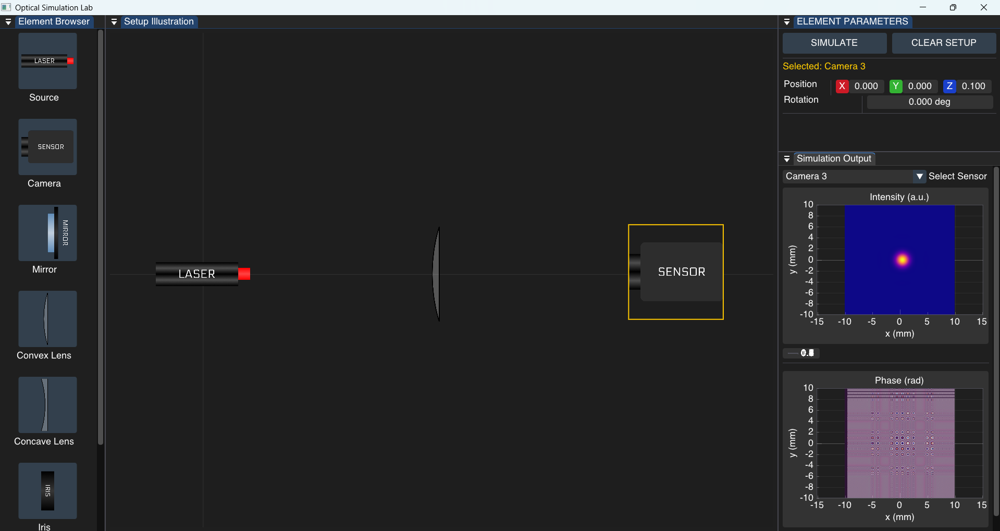

# Optical Simulation Lab

A real-time ray-wave hybrid physics engine that combines **Geometric Ray Tracing** with **Scalar Wave Optics**. Unlike conventional ray tracers, this engine models wave phenomena such as diffraction, Interference, and Fresnel Propagation.


## Features

### Hybrid Physics Engine
* **Ray Tracing:** Employes geometric path tracing for finding possible paths in the optical setup.
* **Wave Optics:** Uses FFT-based scalar field propagation to simulate diffraction patterns (Fresnel & Fraunhofer) and interference.

### Optical Elements
* **Lasers:** Laser sources with different modes (Gaussian, Laguerre-Gaussian, and Hermite-Gaussian) with tunable wavelength and waist.
* **Lenses:** Thin-lens approximation for **Convex** (Converging) and **Concave** (Diverging) lenses.
* **Apertures:**
    * **Iris:** Circular apertures creating Airy Disk diffraction.
    * **Slits:** Multi-Slit diffraction gratings with tunable parameters.
* **Mirrors:** Planar reflectors with adjustable reflectivity.

### Interactive Simulation
* **Real-Time UI:** Built with Dear ImGui. Adjustable element-specific parameters for all elements, sources, and sensors.
* **2D Scene:** Fully navigable 2D environment.

## 📸 Gallery

| Diffraction Grating | Focusing Lens |
|:-------------------:|:-------------:|
|  |  |
| *Multi-slit interference pattern* | *Focusing through a convex lens* |

## 🚀 Getting Started

### Prerequisites
* **C++17** Compiler (MSVC, GCC, or Clang)
* **CMake** (3.10 or higher)
* **FFTW3** (For wave propagation math)
* **OpenGL / GLFW / SDL2** (Depending on your windowing backend)

### Build Instructions

1.  **Clone the Repository**
    ```bash
    git clone [https://github.com/Aman02032006/Optical-Simulation-Lab.git](https://github.com/Aman02032006/Optical-Simulation-Lab.git)
    cd Optical-Simulation-Lab
    ```

2.  **Create Build Directory**
    ```bash
    mkdir build
    cd build
    ```

3.  **Compile with CMake**
    ```bash
    cmake .. -DCMAKE_BUILD_TYPE=Release
    cmake --build . --config Release
    ```

4.  **Run**
    The executable `OpticalSimulationLab.exe` will be generated in the `build/Release` (or `bin`) folder. Ensure `fftw3.dll` is in the same directory before running.

## 🎮 Controls

| Input | Action |
| :--- | :--- |
| **Right-Click + Drag** | Pan Camera |
| **Scroll** | Zoom In/Out |
| **UI Panel** | Modify optical element parameters |

## 📚 Physics Under the Hood

This simulation solves the **Fresnel Diffraction Integral** using Fast Fourier Transforms (FFT).

1.  **Wavefront Representation:** Light is represented as a complex 2D grid ($E_x, E_y$).
2.  **Propagation:** We use the Angular Spectrum Method or Fresnel Transfer Function to propagate the field from plane $z$ to $z + \Delta z$.
3.  **Element Interaction:** Lenses apply a quadratic phase factor $e^{-i k r^2 / 2f}$, and apertures apply a binary amplitude mask.

## 📦 Dependencies

* [Dear ImGui](https://github.com/ocornut/imgui) - User Interface
* [FFTW](http://www.fftw.org/) - Fast Fourier Transform Library
* [GLM](https://github.com/g-truc/glm) - Mathematics
